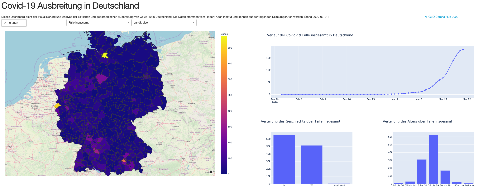

# CoviDash - ein interaktives Covid-19 Dashboard

Diese Projekt ist im Rahmen des [#WirVsVirus Hackathons](https://wirvsvirushackathon.org/) vom 20.-22.03.2020 entstanden.

## Idee
Mit unserem Projekt möchten wir zwei verschieden Zielgruppen ansprechen: Personen, die in der Krise Entscheidungen treffen müssen und alle Bürger:innen.
Erstere benötigen gute Informationsquellen, um in diesen schweren Zeiten die richtigen Maßnahmen ergreifen zu können.
Letztere haben ein Recht darauf, Informationen so transparent wie möglich zu erhalten.

Bestehende Dashboards zu Covid-19 in Deutschland bieten dabei nicht ausreichend Interaktivität.
So hat beispielsweise das [Dashboard des Robert-Koch-Instituts](https://experience.arcgis.com/experience/478220a4c454480e823b17327b2bf1d4)
genaue Fallzahlen pro Landkreis, ermöglicht aber keine Einsichten in zeitliche Verläufe einzelner Regionen, Patientengeschlechter oder Patientenaltersgruppen.

Unser Dashboard setzt hier an und erlaubt es dem Nutzer:in interaktiv die zur Verfügung stehenden Daten zu filtern.
Hierbei sind alle Darstellungen miteinander verknüft, sodass alle Informationen auf allen Filterstufen verfügbar sind.

## Nächste Schritte
Da es sich bei dem Dashboard aktuell noch um einen Prototypen handelt, schlagen wir folgende nächste Schritte vor.

#### Zukünftige technische Herausforderungen
* Deployment des Dashboards auf einem Server, sodass jeder Zugriff darauf erlangen kann.
* Anbindung an eine Datenquelle die es erlaubt, automatisch die aktuellsten Zahlen herunterzuladen und anzuzeigen.
* Testen und optimieren der Darstellungen auf unterschiedlichen Geräten, so dass das Dashboard von jedermann, auch auf Smartphone oder Tablet, angesehen werden kann.

#### Erweiterung der verfügbaren Informationen
* Berechnung von Ausbreitungsrichtung basierend auf Neuinfektionen und geographischen Gegebenheiten (Nachbarschaften der Landkreise, Infrastruktur, ...)
* Eingliederung weiterer Daten, z.B. [anonymisierter Telefondaten](https://www.heise.de/newsticker/meldung/Corona-Krise-Deutsche-Telekom-liefert-anonymisierte-Handydaten-an-RKI-4685191.html)
zur Analyse der Auswirkung von Bewegungen der Bürger:innen.
* Automatisches Erkennen und Anzeigen von "positive deviations" (Fälle in denen die Ausbreitung positiv vom Durchschnitt abweicht), um eventuell dort getroffene Maßnahmen anderswo zu wiederholen.

## Beispiele
